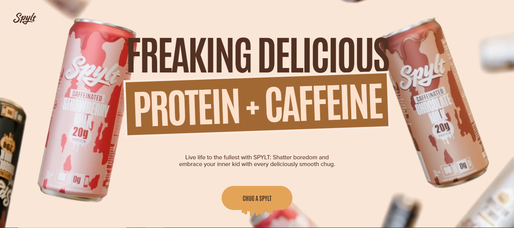
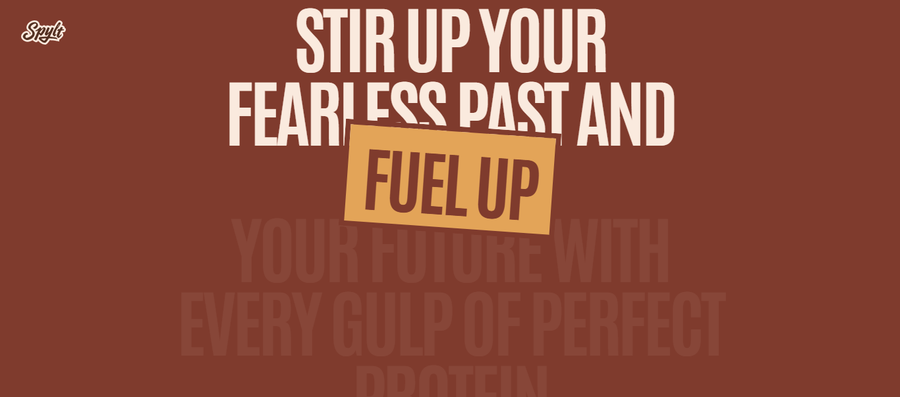
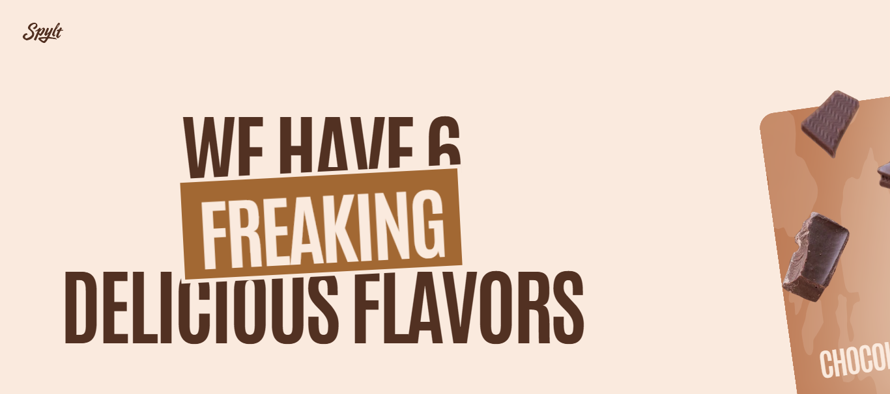
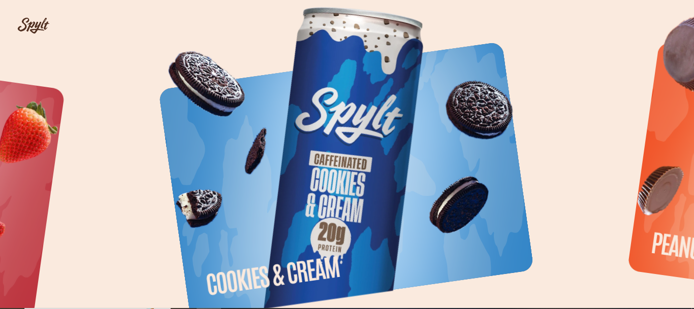
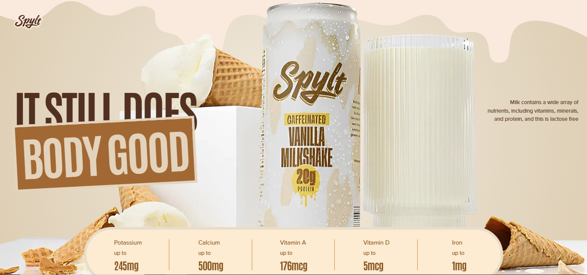
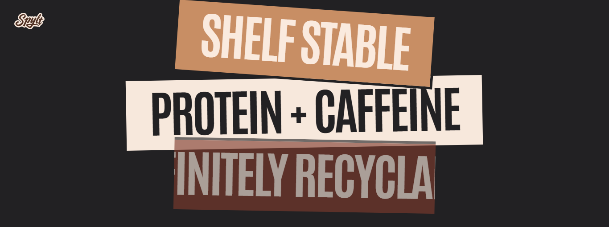
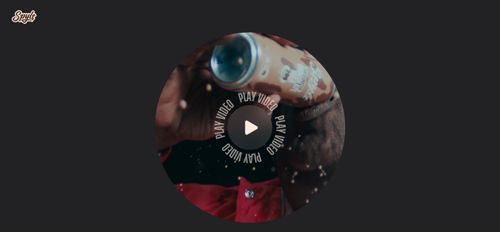
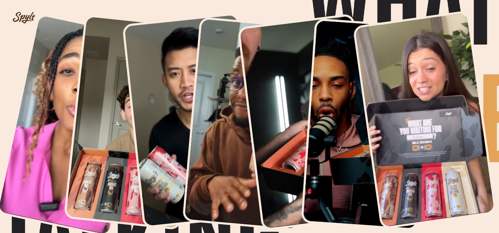
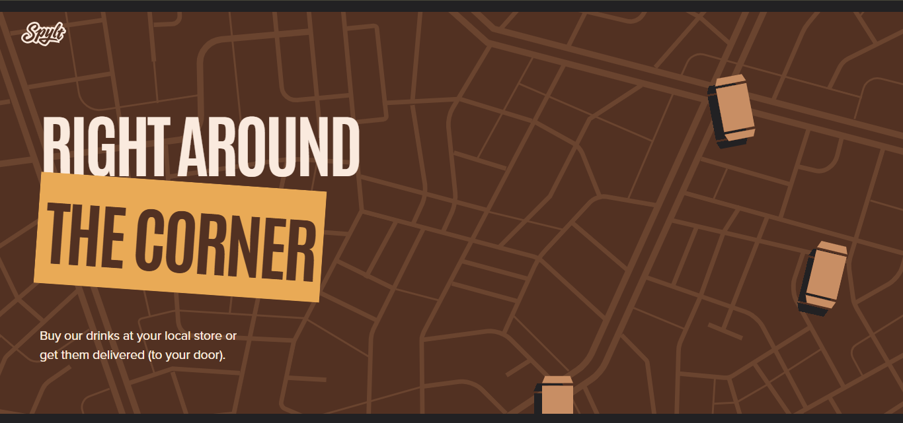
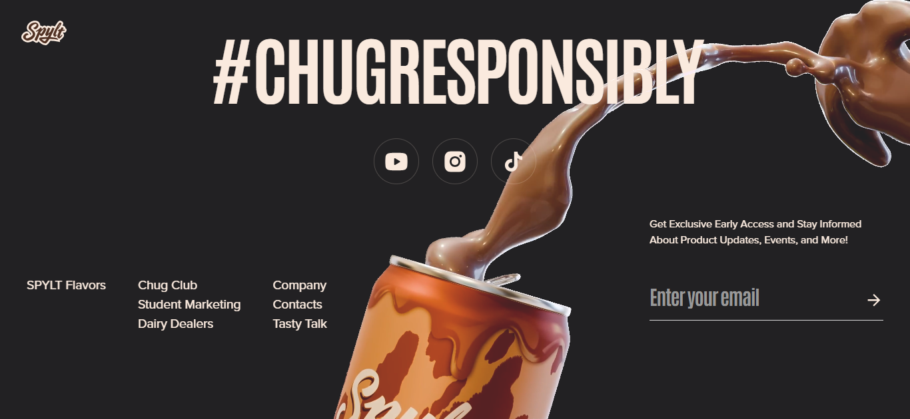

<div align="center">
  
  
  # SPYLT
  
  **Interactive Protein Drink Landing Page**
  
  [](https://spylt-theta.vercel.app/)
  [](https://react.dev/)
  [](https://greensock.com/gsap/)
  [](https://tailwindcss.com/)
  
</div>

---

## 🎯 About

Modern landing page for SPYLT protein drinks featuring advanced GSAP animations, smooth scrolling, and fully responsive design.

**Tech Stack:** React • Vite • GSAP • Tailwind CSS

---

## ✨ Key Features

-  Advanced scroll-based animations with GSAP ScrollTrigger
-  Interactive parallax effects on hover/touch
-  Fully responsive (mobile-first design)
-  Video backgrounds with smooth transitions
-  60fps performance optimization
-  Horizontal/vertical adaptive scrolling

---

## Sections

### Hero Section


**Features:** Video background (desktop) • Character-by-character text reveal • Scroll rotation effect

---

### Message Section


**Features:** Progressive text color change • Word-by-word animation • Clip-path expanding effect

---

### Flavor Showcase



**Features:** 6 interactive flavor cards • Parallax hover effects • Horizontal scroll (desktop) • Touch-optimized

---

### Nutrition & Benefits



**Features:** Animated nutrition facts • Sequential clip-path reveals • Custom colored badges

---

### Video Pin Section


**Features:** Scroll-pinned video • Circular clip-path reveal • Spinning text overlay

---

### Testimonials


**Features:** 7 stacked video cards • Hover-to-play interaction • 3D rotation effects

---

### Footer



**Features:** Animated title reveal • Newsletter signup • Social media links

---

## 🚀 Quick Start

```bash
# Clone repository
git clone https://github.com/amiramostafaemam/spylt.git

# Install dependencies
npm install

# Run development server
npm run dev

# Build for production
npm run build
```

---

## Responsive Design

| Device | Width | Behavior |
|--------|-------|----------|
| 📱 Mobile | < 640px | Vertical layout, simplified animations |
| 📱 Tablet | 768px - 1023px | Hybrid layout, moderate effects |
| 💻 Desktop | 1024px - 1279px | Full features, horizontal scroll |
| 🖥️ Large | ≥ 1280px | Maximum effects, all parallax |

---

## Technologies

**Frontend**
- React 18.3.1
- Vite 5+
- Tailwind CSS 3+

**Animation**
- GSAP 3.12.5
- ScrollTrigger
- ScrollSmoother
- SplitText

**Utils**
- React Responsive

---

## 📂 Project Structure

```
spylt/
├── public/
│   ├── images/          # Assets & screenshots
│   └── videos/          # Video files
├── src/
│   ├── components/      # Reusable components
│   ├── sections/        # Page sections
│   ├── constants/       # Data & configs
│   ├── App.jsx
│   └── main.jsx
├── index.html
└── package.json
```

---

## ⚡ Performance

- Conditional rendering per device
- Lazy-loaded videos
- Hardware-accelerated animations
- Optimized GSAP timelines
- WebP images

---

## 🌐 Browser Support

Chrome • Firefox • Safari 12+ • Edge • Mobile Safari • Chrome Mobile

---

## Author

**Amira Mostafa**

[](https://github.com/amiramostafaemam)
[](https://www.linkedin.com/in/amira-mostafa-bb160a323/)


---

<div align="center">
  
**Built with ❤️ using React, GSAP, and Vite**

[⬆ Back to Top](#spylt)

</div>
